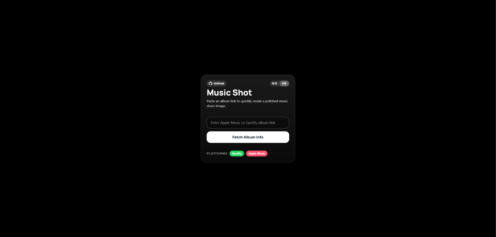
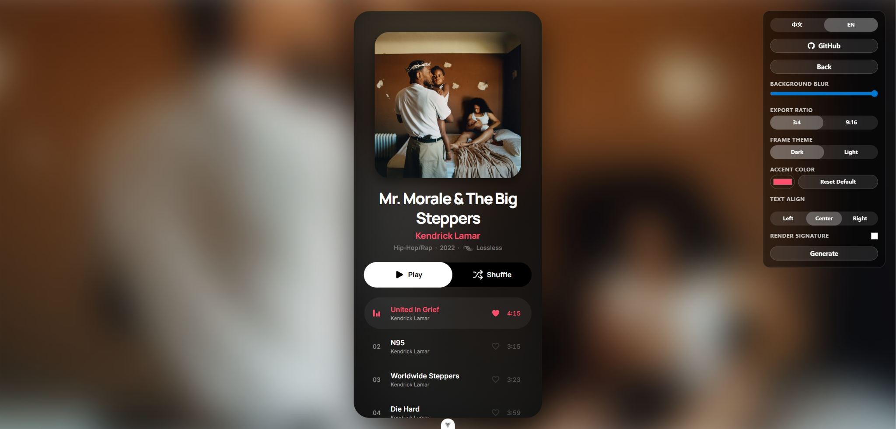

# Music Shot

Generate shareable album images from Apple Music and Spotify links.

[Live Demo](https://musicshot.0v0.one/)

Music Shot is a Vue 3 application that parses an album URL, renders a phone-style album view, and exports the result as a high-resolution PNG.

## Overview

Music Shot is intended for quickly turning album links into reusable visual assets for sharing.

- Supports Apple Music and Spotify album links
- Extracts album title, artist, release date, cover art, genre, and track list
- Renders the result in a phone-style player layout
- Supports background blur, accent color, frame theme, title alignment, and export ratio adjustments
- Supports an optional signature with avatar and handle
- Exports PNG images locally in the browser
- Includes English and Chinese UI
- Provides separate desktop and mobile control panels

## Screenshots

### App Flow

**Input Page**



**Result Page**



### Export Results

<table>
  <tr>
    <th align="center">Happier Than Ever</th>
    <th align="center">Hurry Up Tomorrow</th>
  </tr>
  <tr>
    <td align="center"></td>
    <td align="center"></td>
  </tr>
  <tr>
    <th align="center">The Life of a Showgirl</th>
    <th align="center">DeBI TiRAR MaS FOToS</th>
  </tr>
  <tr>
    <td align="center"></td>
    <td align="center"></td>
  </tr>
</table>

## Usage

1. Paste an Apple Music or Spotify album URL.
2. Fetch album metadata.
3. Adjust the presentation in the control panel.
4. Export the result as a PNG.

## Implementation Notes

### Album parsing

Music Shot normalizes data from Apple Music and Spotify into a single internal album model.

### Customization

Available adjustments include:

- background blur
- export ratio (`3:4` and `9:16`)
- dark or light frame theme
- title alignment
- accent color override
- signature visibility, avatar, and handle

### Export pipeline

The application captures the rendered phone frame in the browser, composites it onto a blurred cover background, and downloads the final image as a PNG.

## Tech Stack

- Vue 3
- Vite
- TypeScript
- Tailwind CSS
- Paraglide JS
- `@zumer/snapdom`

## Architecture

- Spotify data is parsed from the Spotify embed page payload.
- Apple Music data is parsed from JSON schema embedded in the album page.
- Browser requests are routed through a proxy because direct access to upstream pages is blocked by CORS.
- Export rendering is performed client-side.
- Locale, signature, avatar, blur, theme, and ratio preferences are persisted in `localStorage`.

## Requirements

- Node.js `^20.19.0 || >=22.12.0`
- Bun recommended

## Development

Install dependencies:

```bash
bun install
```

Start the development server:

```bash
bun dev
```

Build for production:

```bash
bun run build
```

Preview the production build:

```bash
bun preview
```

Run type checking:

```bash
bun run type-check
```

Run linting:

```bash
bun run lint
```

Format source files:

```bash
bun run format
```

Compile localization messages:

```bash
bun run i18n:compile
```

## Project Structure

```text
src/
  components/      Input screen, result screen, desktop/mobile control panels
  composables/     Parsing flow, UI settings, export pipeline
  paraglide/       Generated i18n runtime and locale messages
  assets/          Static assets used in the UI
  service.ts       Cross-platform music link parsing and normalization
```

## Limitations

- Only album links are supported.
- The parser depends on upstream page structures remaining stable.
- The current implementation uses `https://music-shot-proxy.0v0.one/` as a public proxy for HTML fetching.
- For production use, replacing the public proxy with your own backend or Cloudflare Worker is recommended.

## Possible Extensions

- Playlist support
- Single-track support
- Additional export presets
- Background style presets
- More resilient parser fallback logic
- Automated tests for parsing and export behavior

## Disclaimer

This project is provided for learning, research, and personal non-commercial use.

Album artwork, music metadata, platform names, logos, and related intellectual property belong to their respective rights holders. Users are responsible for ensuring that their use complies with applicable copyright, trademark, platform, and local legal requirements.

If you plan to use this project in production or for commercial purposes, replace any third-party proxy or unofficial data-fetching approach with an authorized and compliant solution.

## License

MIT
